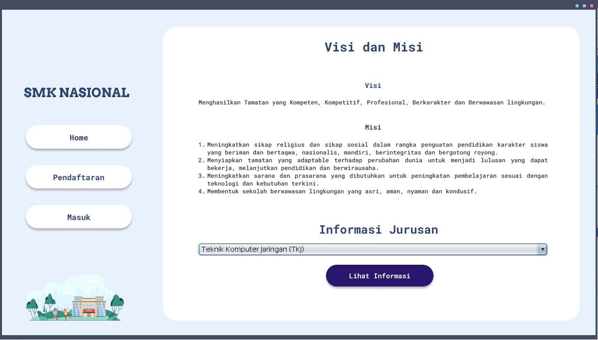
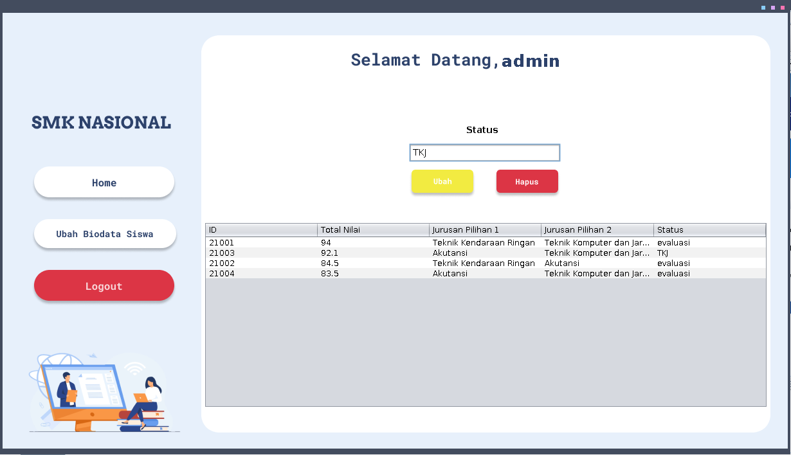

# Sistem PPDB SMK Nasional

## # Overview
[ Main Form ]

[ Informasi Sekolah Form ]

[ Pendaftaran Form ]

[ Masuk Form ]

[ Masuk Siswa Form ]

[ Masuk Staff Form ]

## # Dibuat oleh
1. Widi Afandi (Project Manager & Programmer)

2. Ahmad Saiful H (Programmer & Designer)

3. Bayu Setyaji (Analys)
