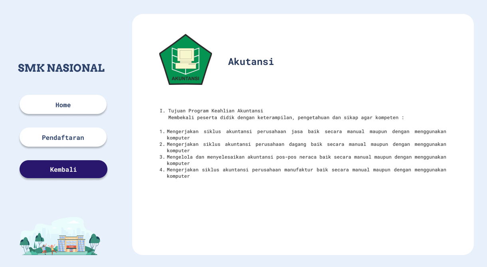
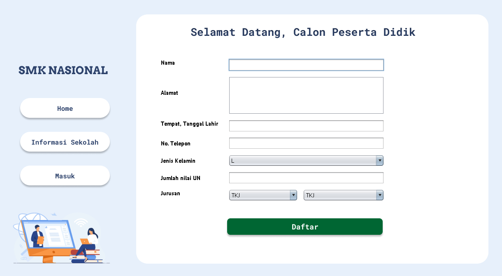
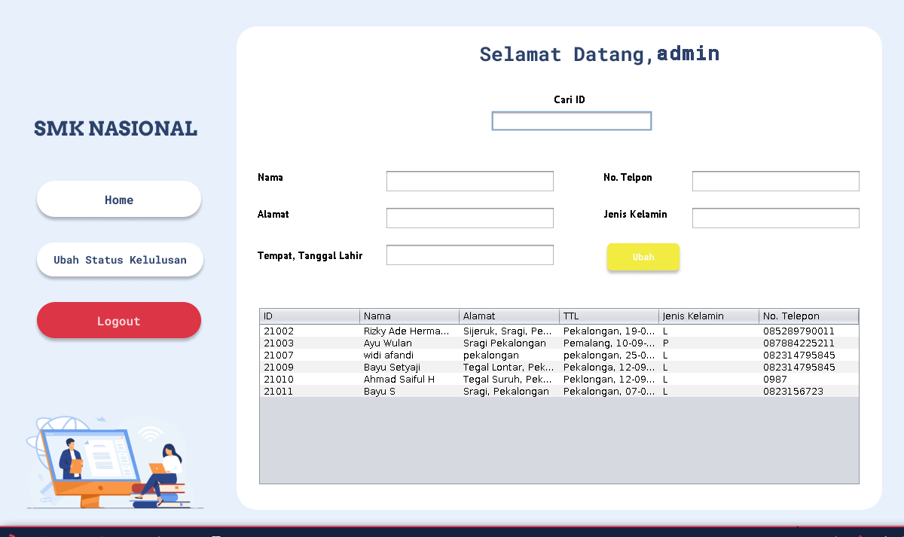

## Tim Megono (IF07K)
1. Widi Afandi - 19102127 (Project Manager & Programmer)

2. Ahmad Saiful H - 19102158 (Programmer & Designer)

3. Bayu Setyaji - 19102157 (Analyst)

## Deskripsi
Aplikasi yang kelompok kami buat adalah “Aplikasi Pendaftaran Peserta Didik Baru di SMK
Nasional”. Aplikasi ini bertujuan dan berfungsi sebagai sarana pendaftaran calon peserta didik
baru yang akan melanjutkan jenjang pendidikan di SMK Nasional. Aplikasi ini memberikan
informasi mengenai SMK Nasional, mulai dari informasi umum dan informasi masing-masing
jurusan yang ada di SMK Nasional. Selain itu aplikasi ini juga terdapat fungsi login untuk siswa dan
staff, dimana jika login sebagai siswa maka akan memiliki hak akses untuk melihat data diri dari
siswa tersebut serta mengerjakan soal ujian sebagai nilai tambah, dan jika login sebagai staff maka
akan memiliki hak akses untuk melihat semua daftar siswa yang telah mendaftar, menghapus dan
mengedit seluruh data siswa yang ada.

## Overview
* *Home*

  

* *Informasi Sekolah*

  
  
  
  

* *Pendaftaran*

  

* *Masuk*

  

* *Masuk Sebagai Siswa*

  
  
  
  
* *Masuk Sebagai Staff*

  
  
